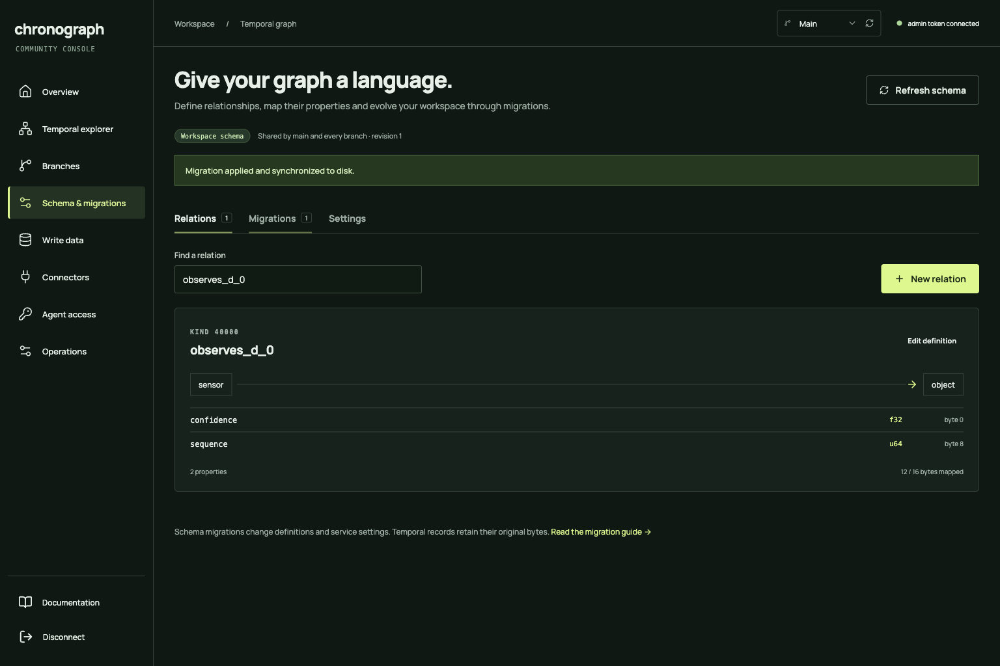
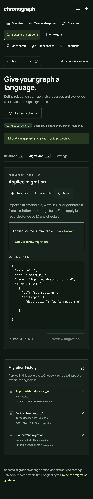

# Schema workspace verification

The existing Community console now supports relation definitions, typed properties, database settings and imported JSON migrations at `/app/schema`. Validation, durable application and migration history are implemented in the Rust service and shared by HTTP and MCP. Verification passed on September 10, 2026.

## Verified behavior

- Relations: named u16 kinds, endpoint documentation, descriptions, non-overlapping property layouts, visual byte map, searchable catalog, editing and draft removal.
- Migrations: import/export, editable JSON, server preview, before/after comparison, checksum, stale-revision protection, admin-only apply, immutable history, safe retries and draft preservation.
- Settings: workspace name/description, default durability, default query page size and strict defined-kind enforcement. Explicit query/write options still take precedence.
- Graph integration: structured properties in Write data; exact u64/i64 values remain strings. Service queries and explorer results expose relation names and decoded properties alongside original hex.
- Recovery: catalog and history commit together, replay/checksum validation on startup, fail-closed persistence errors, consistent backup capture, validated restore, and SIGKILL/restart recovery.
- Agent/file workflows: five official MCP tools with the same authorization rules, plus `scripts/migrate.mjs` for preview/apply of local JSON files.

## Environment and checks

Browser plugin not available; used the existing headed Playwright Chromium workflow. Test URL: `http://127.0.0.1:18083`. Desktop viewport: 1536×1024. Mobile: iPhone 13 profile, 390×664 CSS pixels. Test workspaces and credentials were temporary; existing `data/`, `community-data/` and `config/` were not used.

| Check | Result | Evidence |
| --- | --- | --- |
| Workspace build, tests, Clippy with warnings denied, formatting | PASS · 58 Rust tests, one existing ignored test | [Gate output](results.json), [test log](test.log) |
| Production React/TypeScript build | PASS | [UI build log](ui-build.log) |
| Page identity and nonblank rendering | PASS | Correct schema and documentation headings/URLs in browser assertions |
| Framework overlays and relevant console errors | PASS | No runtime errors on the successful flow; negative cases intentionally produce HTTP 400/409/403 |
| Interaction proof | PASS | Create → preview → apply → typed insert → import/export → settings → history; malformed/stale requests and read-only access checked |
| Full browser regression suite | PASS · 24 runs | [Desktop/mobile, twice each](e2e.json) |
| Final schema and guide checks after visual adjustment | PASS · 8 runs | [Final browser evidence](../phase-schema-final/e2e.json) |
| Official HTTP/MCP regressions | PASS | [Protocol report](protocol.json) |
| Schema MCP, CLI, backup/restore and abrupt restart | PASS | [Schema protocol report](schema-protocol.json) |
| Documentation and CI workflow | PASS · 21 chapters; internal links valid; mdBook and actionlint pass | `scripts/release/check-docs.py`, mdBook, actionlint |
| Responsive screenshots and overflow checks | PASS | Desktop catalog and mobile migration/history images below; guide also checked for page overflow |

Browser test failures during development were fixed: exact-label locators included select/textarea content, so tests now use accessible roles; the guide link was corrected to the existing documentation route. The persistence test fixture now changes the content without accidentally changing its migration ID. Final outputs above are passing runs.

## Latency

Apple M5, arm64, release build, local loopback HTTP without TLS. Baseline: 100,000 stored versions, 32,000 active at the query timestamp. Twenty warmups per workload, full responses parsed by the client. Typed measurements use one relation with two properties and one applied migration. Constraint-changing previews can scan history; the preview measurement below is a metadata-only change. Measurements are local observations, not production guarantees or hard real-time deadlines.

| Workload | Samples | p50 ms | p95 ms | p99 ms |
| --- | ---: | ---: | ---: | ---: |
| HTTP stats | 500 | 0.187 | 0.290 | 0.637 |
| HTTP as-of first page (1000 rows) | 300 | 2.265 | 2.980 | 4.481 |
| HTTP uniform sample (16 edges) | 300 | 0.193 | 0.421 | 0.537 |
| MCP as-of first page (1000 rows) | 300 | 3.010 | 4.111 | 6.412 |
| HTTP as-of first page, 8 clients | 400 | 5.586 | 9.523 | 11.120 |
| MCP as-of first page, 8 concurrent requests | 400 | 6.819 | 10.082 | 11.980 |
| HTTP durable single insert | 200 | 4.078 | 5.348 | 6.152 |
| HTTP schema catalog (1 relation, 1 migration) | 200 | 0.134 | 0.259 | 0.527 |
| HTTP schema preview (metadata-only) | 200 | 0.131 | 0.306 | 0.700 |
| HTTP typed as-of first page (1000 rows) | 300 | 2.648 | 3.096 | 3.632 |
| MCP typed as-of first page (1000 rows) | 200 | 3.473 | 4.425 | 4.684 |
| HTTP typed durable single insert | 200 | 4.012 | 5.138 | 6.942 |

[Environment and summary](latency.json) · [Raw latency samples](latency-samples.csv)

## Reproduce

```sh
python3 scripts/check-phase.py phase-schema
npm --prefix ui run format:check
npm --prefix ui run build
cargo build --locked --release -p chronograph-server --bins
CHRONOGRAPH_REPORT_PHASE=phase-schema node scripts/protocol-test.mjs
CHRONOGRAPH_REPORT_PHASE=phase-schema node scripts/schema-test.mjs
(cd ui && CHRONOGRAPH_REPORT_PHASE=phase-schema npx playwright test --headed --repeat-each=2)
CHRONOGRAPH_REPORT_PHASE=phase-schema node scripts/service-latency.mjs
python3 scripts/release/check-docs.py
```

Do not publish Playwright traces: they can include temporary test credentials. The public JSON summaries and these screenshots contain no token values.

## Limits and delivery state

Migrations are Chronograph JSON, not SQL. Properties occupy the existing 16-byte edge payload; endpoint labels are documentation, not enforced node types. Definitions are workspace-wide and validation applies to HTTP/MCP, not direct embedded Rust writers. Used layouts cannot be changed or dropped; a new kind is required for an incompatible layout. No automatic record transformation/down migration is provided. Schema limits are documented in [the migration guide](../../../../docs/SCHEMA.md).

This feature is built in source and the local UI/release binaries. The earlier `dist/v0.3.0` release candidate archives were preserved and predate this feature. No remote deployment or publication occurred. The operator's localhost server remains stopped; test processes shut down after verification.

## Screenshots




