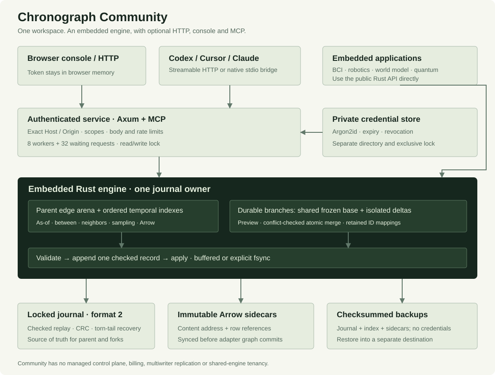
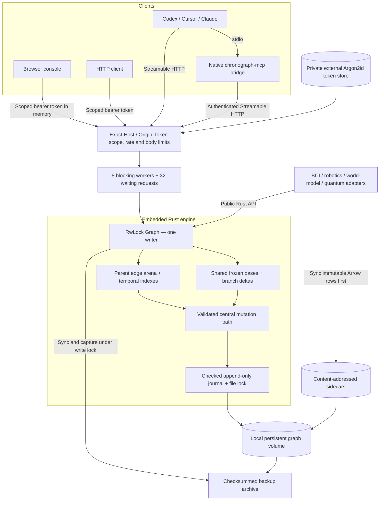
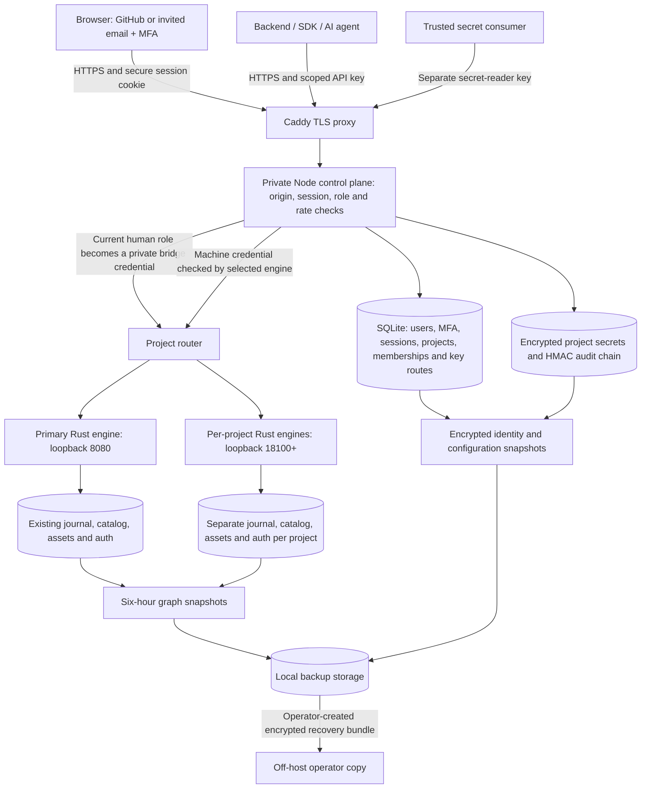

# Architecture

ChronoDB Community is an embedded temporal graph engine with an optional authenticated service, browser console and native MCP bridge. The engine has no networking or authentication dependency. Managed wraps the same engine in a separate private identity and project control plane. The first diagram describes Community; the deployed Managed boundary is below.

## Diagram source

The SVG above is available offline in the console and mdbook. The Mermaid source is included for reuse. Embedded callers manage their own read/write boundary; service callers use the service lock.

## Storage and time

Every directed relationship version has source/destination node IDs, a u16 kind, inclusive `valid_from`, exclusive `valid_to` and 16 opaque payload bytes. Timestamps are signed i64 microseconds in an application-declared clock domain. `i64::MAX` is the open-end sentinel. Node identities are non-temporal. The engine has no schema language or hidden device clock conversion.

Dense edge storage supports full-history scans. Per-node BTreeMaps ordered by `(valid_from, EdgeId)` and per-relationship timelines support neighborhood lookup and late arrivals. A late insertion shortens its active predecessor and stops at an existing successor; equal starts retain superseded versions as empty intervals. Explicit ends and invalidation preserve gaps. Batches prepare independent source groups with Rayon and commit one checked frame.

The journal is authoritative. Opening holds the exclusive standard-library file lock, replays through a read-only mmap, drops that mapping and then repairs a recognized torn tail. No mmap remains while appending. Complete invalid records, interior corruption and unsupported versions/tags fail without rewriting the source. Format-1 migration is explicit and writes a separate destination. [Format details](FORMAT.md).

Writes require `&mut Graph`, and reads borrow `&Graph`; there are no simultaneous independent writers or MVCC read transactions. Buffered is the default. `sync()`, `close()` or `Durability::Fsync` establishes an error-reporting durability checkpoint. A failed append/sync disables the writer because the disk outcome can be ambiguous.

## Durable branches

A fork captures only versions active at its creation time, with their ends frozen open. Identical parent revision/time forks share an immutable `Arc` base. Each branch stores only new versions, new identities and inherited-end overrides. Queries before the fork time are rejected. New branch IDs belong to the selected fork.

Parent revision and global operation revision are separate. A merge requires an unchanged parent revision and rejects touched relationships with pre-existing future observations/finite expirations. Preview validates without mutation; actual merge validates again, writes one atomic prepared record, returns new ID mappings and closes the fork. Payloads and sidecars are never rewritten by the engine. Closed metadata and merge results survive restart, and discarded deltas are never merged. [Branch contract](BRANCHES.md).

## Community service and authentication

Axum serves built UI assets, docs, `/v1` and `/mcp` on one origin. Middleware checks exact Host and any supplied Origin, bounded bodies, a current bearer credential and its workspace-wide read/ingest/admin scope. Remote origins require HTTPS at the reverse proxy. No cookie/session/password/CSRF flow is present. Forwarded Host is not trusted, and the strict CSP allows same-origin assets without inline scripts.

At most eight blocking graph operations run with 32 queued requests. Queue waits time out after 30 seconds; excess work receives 503. A running operation keeps its permit until completion even if its client disconnects. CPU/disk work stays off the async executor. Queries take a read lock; mutations and consistent backups take the write lock. A full scan or backup can delay writes. There is no hard real-time deadline guarantee.

API writes use schema settings (initially buffered) unless `CHRONOGRAPH_REQUIRE_FSYNC=true` enforces fsync. Managed and production Compose enable that floor and reject buffered writes/settings. Other callers can explicitly request `durability: "fsync"`. The console selects fsync for writes. Graph IDs, timestamps and graph revisions stay decimal strings through HTTP, MCP and the UI. Cursor fingerprints bind pagination to the selected parent/fork, query and global revision, and reject changes between pages.

The external private authentication file stores salted Argon2id hashes of 256-bit random token secrets. Atomic file replacement and directory synchronization protect updates; a separate stable lock prevents concurrent offline administration. A SHA-256 verification cache is process-local; expiry and revocation are still checked on each request. Uncached verification has its own concurrency/rate bounds. There are no user passwords, cloud accounts, OAuth provider, team role store or cross-store graph/auth transaction.

## Service schema catalog

`schema.json` records service settings, relation definitions and migration sources/checksums. The catalog is shared across main and branches, separate from temporal journal state. Admin-only application revalidates under the graph write lock, synchronizes data and atomically replaces the catalog. Preview is read-only. All catalog access follows the graph-then-catalog lock order when both locks are needed.

HTTP/MCP ingestion validates known 16-byte property layouts and optionally requires defined relation kinds. Queries decode named values without changing stored bytes. The embedded Rust engine remains schemaless; endpoint labels are documentation. Consistent backups include the catalog, and restore validates its replay before publishing the destination. [Schema contract](SCHEMA.md).

## Connectors and sidecars

Adapters are separate crates using the public engine API. The optional BCI LSL runtime does not enter a normal service build. File adapters bound record sizes and schema counts before parsing. Robotics retains original nanosecond acquisition fields; world-model snapshots preserve complete state and RNG through a versioned codec; quantum support is explicitly exploratory.

Structured rows are immutable Arrow sidecars with content addresses and full checksums. A new sidecar is written, synchronized and published before its compact row references enter an atomic journal batch. Failed graph appends may leave unreferenced sidecars; automatic garbage collection is not implemented. Video stays an explicit reference, not an automatic remote fetch or decoder. [Connector guides](connectors/worldmodel.md).

## Console and backup

React/Vite produce static assets with self-hosted typography and locally generated hero artwork. Build configuration selects the Community or Managed landing and console. The console selects a parent or branch, inspects a native SVG graph and exact table values, manages credentials and local backups, and links to supported connector workflows. Managed adds accounts, projects, teams and a secret vault. A graph preview displays at most 40 nodes/80 edges from a bounded result page. Synthetic preview is separately labeled, read only and makes no graph API calls.

A backup holds the graph write lock, synchronizes the journal and captures its journal, disposable parent index snapshot and regular connector sidecars in a checksummed archive. Credentials are excluded. Restore uses a new staging directory, rejects unsafe entries/checksum/size/replay mismatches, and publishes only into an absent or empty destination. Branch journal records restore active deltas and closed lifecycle results. Local recovery tests do not prove Managed off-host restoration.

## Deployment boundary

One Community service owns one local journal and its volume. The intended container deployment runs as a non-root user with separate persistent graph and credential volumes, behind Caddy with only proxy ports exposed. The final release report records whether container and TLS tests actually ran. Horizontal replicas opening the same journal, shared-engine multi-tenancy and rolling multiwriter upgrades are unsupported.

## Deployed Managed preview

Browser sessions require MFA and current project membership. Machine API keys and
MCP requests bypass browser sessions and retain native read/ingest/admin scopes.
Secret-reader credentials are separate from graph keys and cannot access MCP.
New projects start with fsync durability. Schema changes retain the engine's
preview/checksum/revision checks and survive process restart.

Each project has a separate Rust process and data directory, but newly provisioned
engines share one Unix service identity and host. This is application/process
isolation, not dedicated tenant containers or VMs. Secrets are encrypted; graph
journals are not application-encrypted. Identity and graph snapshots are not one
cross-database transaction. Automated off-host backup, replication, billing and
an uptime SLA are absent. See [Managed operations and limits](HOSTED.md) and
[edition boundaries](EDITIONS.md).
